# FitnessTracker Microservices Project

## Overzicht
Dit project is een fitness tracking applicatie opgebouwd met een microservices architectuur.  
De applicatie bestaat uit drie back-end services, een API Gateway en databanken.

### Microservices
- **Users Service (PostgreSQL)**  
  Beheer van gebruikersaccounts: email, displayName, aanmaken, aanpassen, verwijderen.

- **Workouts Service (MongoDB)**  
  Opslag van workouts met datum en oefeningen. CRUD-API beschikbaar.

- **Progress Service (PostgreSQL)**  
  Houdt de voortgang bij: aantal workouts en best lifts per gebruiker.

- **Gateway (Spring Cloud Gateway)**  
  Toegangspunt tot alle microservices. Hier wordt authenticatie via Google OAuth2 toegepast.

---

## Architectuur
Hier komt een schema van de architectuur.  
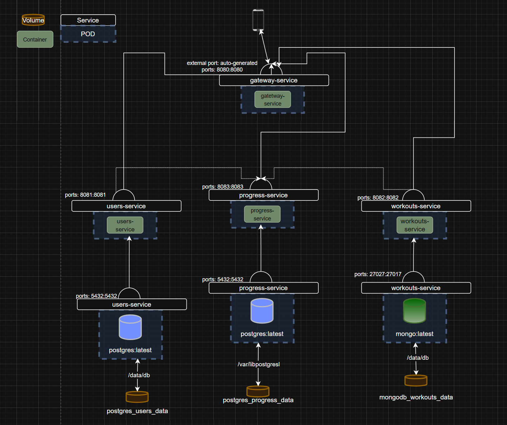


## Deployment

De volledige applicatie draait via Docker Compose.  
Iedere service is beschikbaar als container (op Docker Hub gepusht en via GitHub Actions gebouwd).

### `docker-compose.yml`
```yaml
version: "3.9" # docker compose versie

services:
  # postgres db
  postgres:
    image: postgres:16
    environment:
      POSTGRES_USER: admin
      POSTGRES_PASSWORD: admin
    ports:
      - "5432:5432" # db bereikbaar op 5432
    volumes:
      - pgdata:/var/lib/postgresql/data # data blijft bewaard
      - ./db/init.sql:/docker-entrypoint-initdb.d/init.sql:ro # init scriptje
    healthcheck: # check of db up is
      test: ["CMD-SHELL", "pg_isready -U admin"]
      interval: 5s
      timeout: 3s
      retries: 20

  # mongo db
  mongo:
    image: mongo:7
    ports:
      - "27017:27017" # mongo bereikbaar op 27017
    volumes:
      - mongodata:/data/db # data blijft bewaard
    healthcheck: # check of mongo up is
      test: ["CMD", "mongosh", "--eval", "db.adminCommand('ping')"]
      interval: 5s
      timeout: 3s
      retries: 20

  # users microservice (van dockerhub)
  users-service:
    image: ${DOCKERHUB_USERNAME}/apt-fittracker-users-service:${IMAGE_TAG:-latest}
    environment:
      SPRING_PROFILES_ACTIVE: docker
      SPRING_DATASOURCE_URL: jdbc:postgresql://postgres:5432/usersdb
      SPRING_DATASOURCE_USERNAME: users
      SPRING_DATASOURCE_PASSWORD: users
    depends_on:
      postgres:
        condition: service_healthy

  # progress microservice (van dockerhub)
  progress-service:
    image: ${DOCKERHUB_USERNAME}/apt-fittracker-progress-service:${IMAGE_TAG:-latest}
    environment:
      SPRING_PROFILES_ACTIVE: docker
      SPRING_DATASOURCE_URL: jdbc:postgresql://postgres:5432/progressdb
      SPRING_DATASOURCE_USERNAME: progress
      SPRING_DATASOURCE_PASSWORD: progress
    depends_on:
      postgres:
        condition: service_healthy

  # workouts microservice (van dockerhub)
  workouts-service:
    image: ${DOCKERHUB_USERNAME}/apt-fittracker-workouts-service:${IMAGE_TAG:-latest}
    environment:
      SPRING_PROFILES_ACTIVE: docker
      SPRING_DATA_MONGODB_URI: mongodb://mongo:27017/fittrackr
    depends_on:
      mongo:
        condition: service_healthy

  # gateway (api toegangspunt, van dockerhub)
  gateway:
    image: ${DOCKERHUB_USERNAME}/apt-fittracker-gateway:${IMAGE_TAG:-latest}
    ports:
      - "8080:8080" # bereikbaar op localhost:8080
    environment:
      SPRING_PROFILES_ACTIVE: docker
      SPRING_CLOUD_COMPATIBILITY_VERIFIER_ENABLED: "false" # nodig voor spring cloud
    depends_on:
      - users-service
      - workouts-service
      - progress-service

# volumes (persistent storage voor db’s)
volumes:
  pgdata:
  mongodata:
````


## Hoe gebruiken

1. Clone de repository

   ```bash
   git clone https://github.com/<jouw_repo>/fittracker.git
   cd fittracker
   ```

2. Start de omgeving

   ```bash
   docker compose up -d
   ```

3. Services

   * Gateway: [http://localhost:8080](http://localhost:8080)
   * Users-service: interne poort 8081 (via gateway aanspreken)
   * Workouts-service: interne poort 8082 (via gateway aanspreken)
   * Progress-service: interne poort 8083 (via gateway aanspreken)
   * PostgreSQL: localhost:5432 (user: `admin`, pass: `admin`)
   * MongoDB: localhost:27017

4. Authenticatie

   * Log in via Google OAuth2 bij het openen van de gateway.
   * Sommige endpoints zijn secured, anderen public.

5. Testen met Postman

   * Importeer de Postman collectie uit `docs/FitnessTracker.postman_collection.json`.
   * Stel de `baseUrl` environment variable in op `http://localhost:8080`.
   * Voer de requests uit zoals hieronder beschreven.
   * Voeg screenshots onder elke sectie in.


## Endpoints (via Gateway)

### Users

* **GET /users** – Alle gebruikers ophalen
* **GET /users?email=…** – Gebruiker zoeken op email
* **POST /users** – Nieuwe gebruiker aanmaken
* **GET /users/{id}** – Gebruiker ophalen op ID
* **PUT /users/{id}** – Gebruiker bijwerken
* **DELETE /users/{id}** – Gebruiker verwijderen

#### GET Users

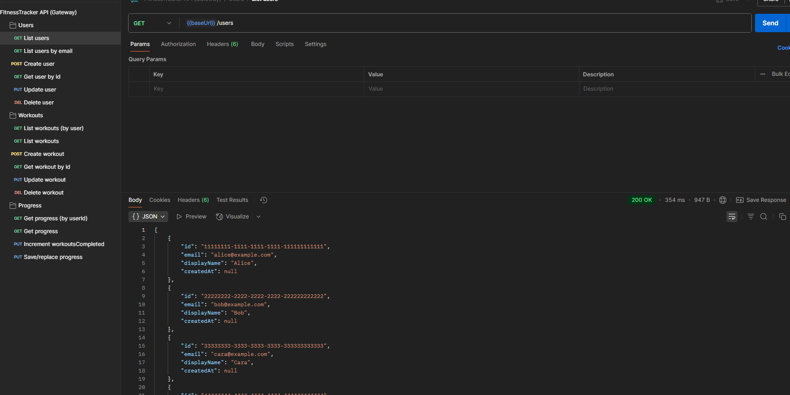

#### GET Users Filtered email

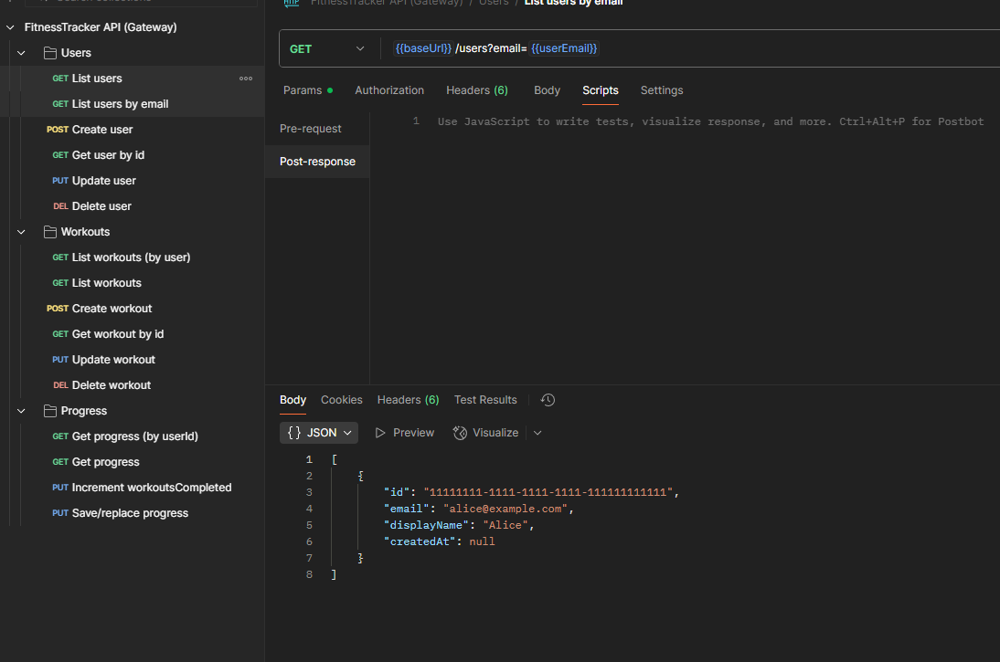

#### POST User

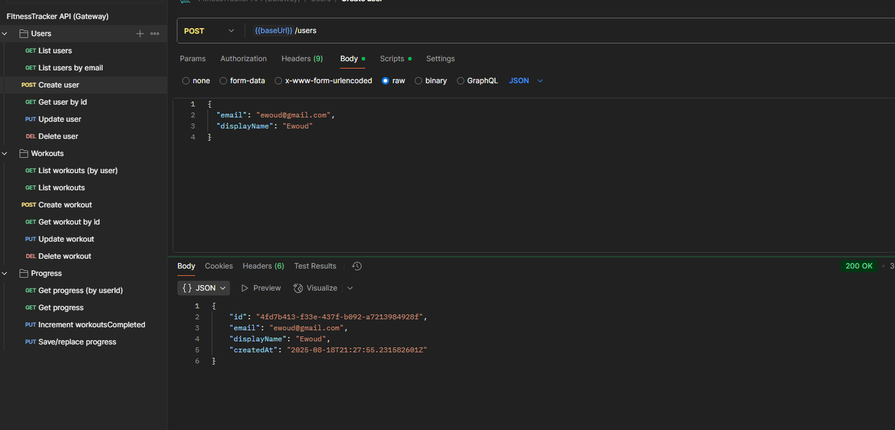

#### GET User ID

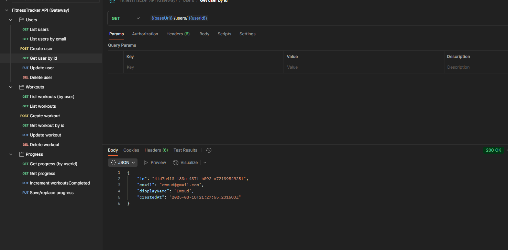

#### PUT User

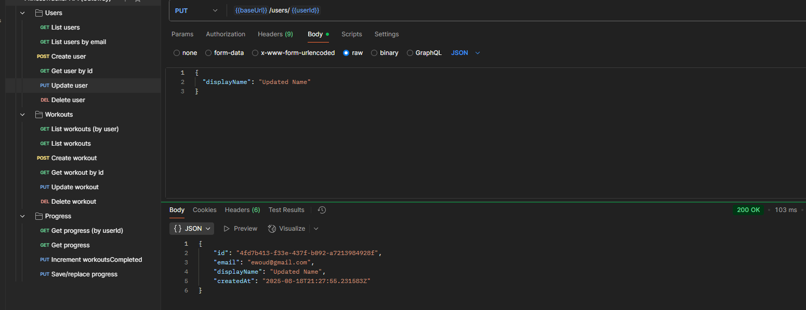


#### DELETE User

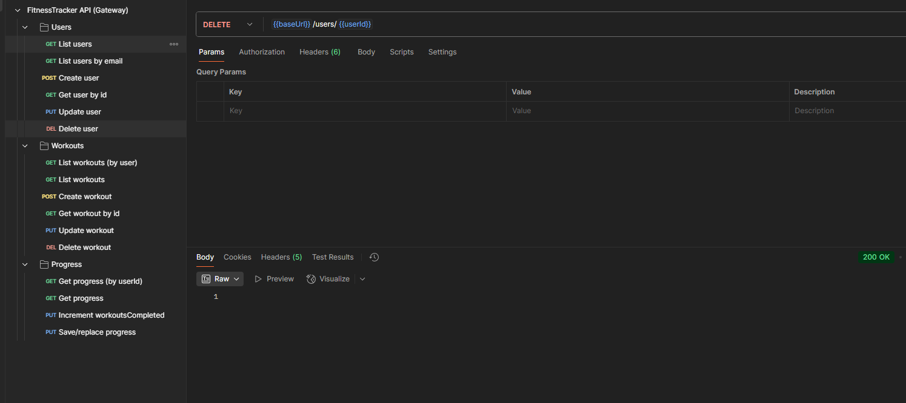

### Workouts

* **GET /workouts?userId=…** – Alle workouts van een gebruiker ophalen
* **POST /workouts** – Nieuwe workout aanmaken
* **GET /workouts/{id}** – Workout ophalen op ID
* **PUT /workouts/{id}** – Workout bijwerken
* **DELETE /workouts/{id}** – Workout verwijderen
#### GET Workouts Filtered

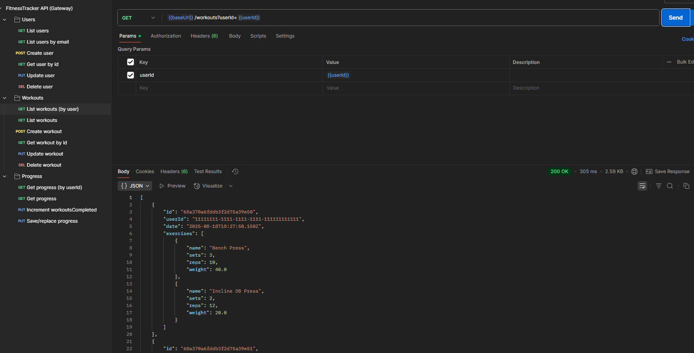

#### GET Workouts ALL
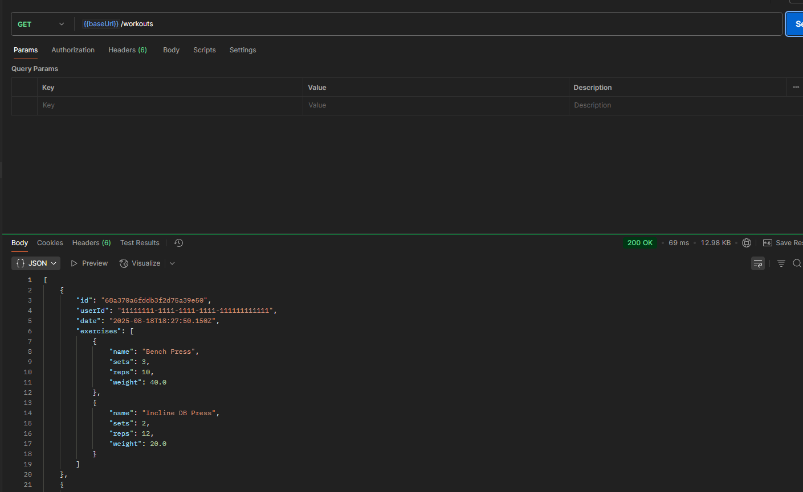

#### CREATE Workouts
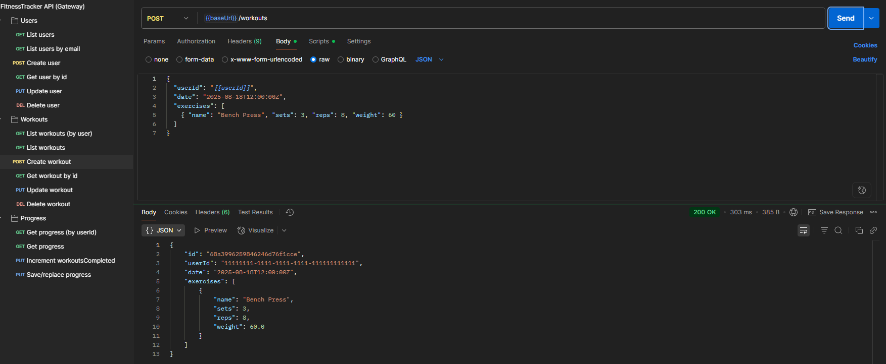

#### GET Workout ID
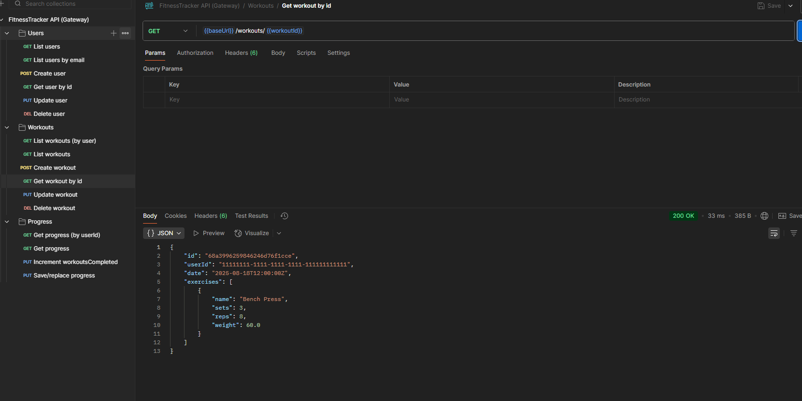

#### PUT Workout
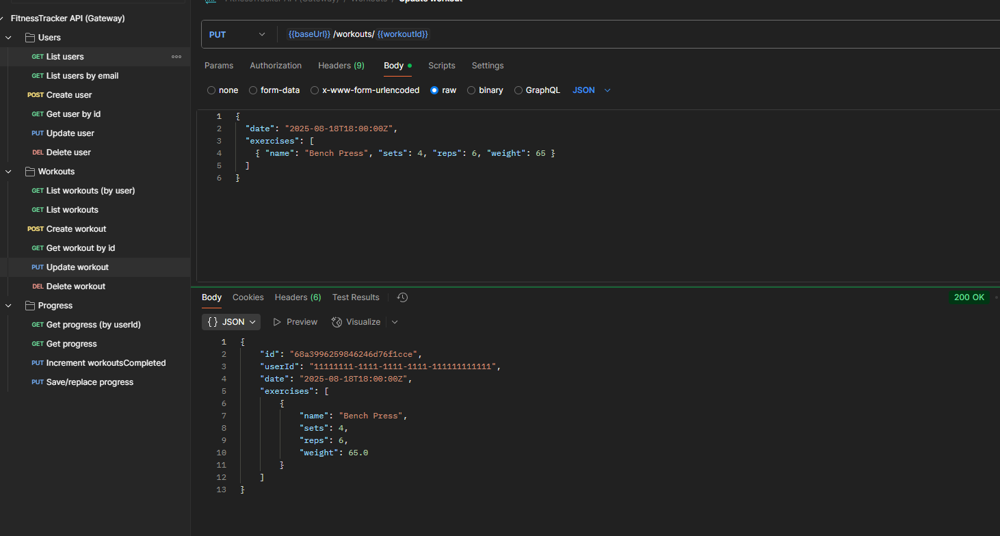

#### DELETE Workout
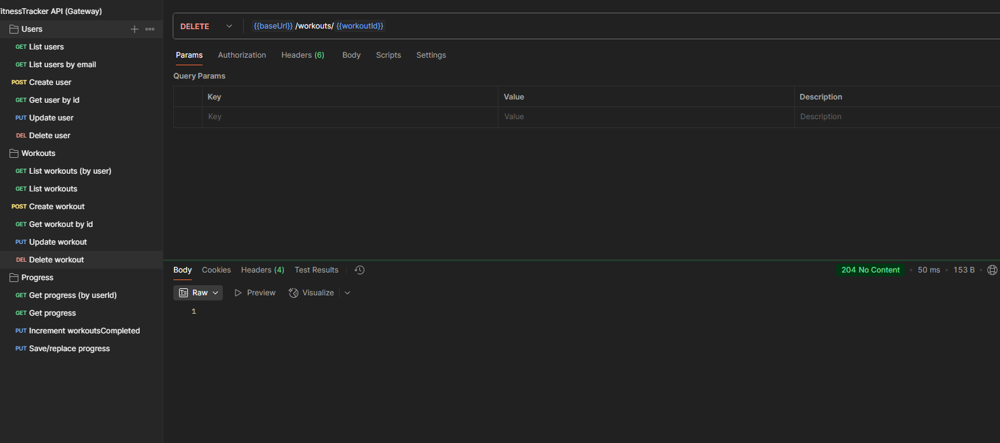


### Progress

* **GET /progress?userId=…** – Progressie ophalen van gebruiker
* **PUT /progress/{userId}/increment** – Verhoog het aantal voltooide workouts met 1
* **PUT /progress** – Nieuwe progressie instellen of overschrijven
#### GET Progress Filtered

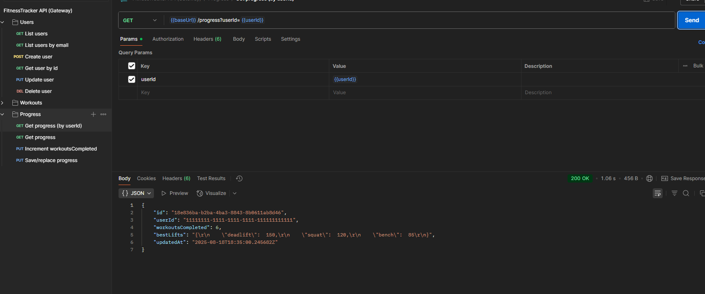

#### GET Progress All

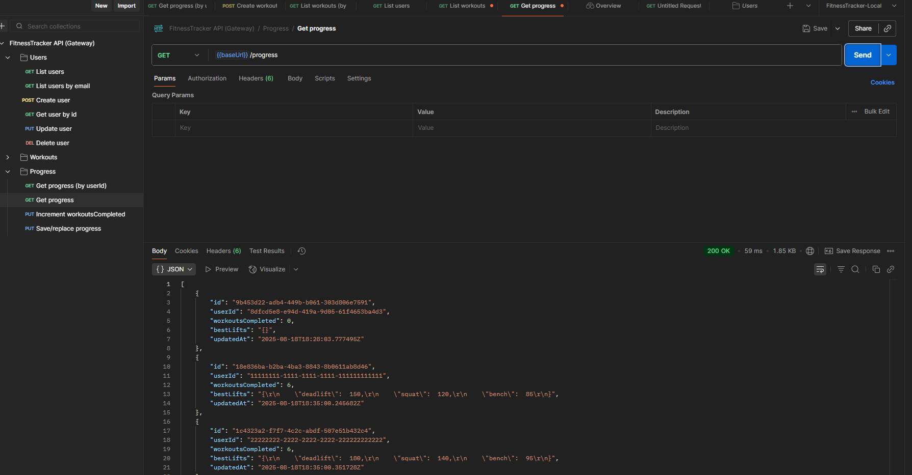

#### PUT Increment workout

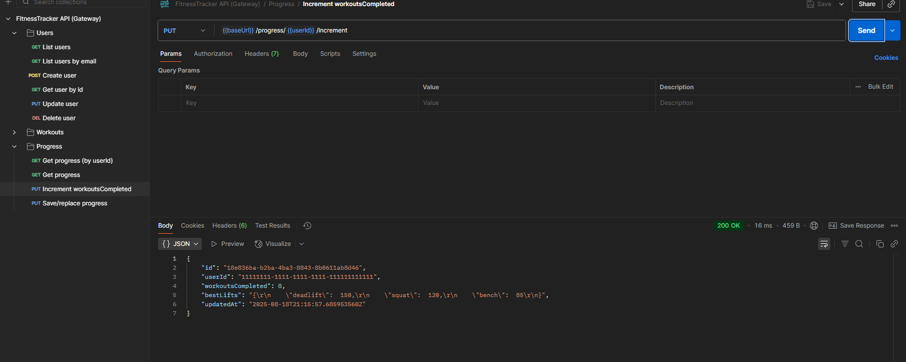

##### plus 1

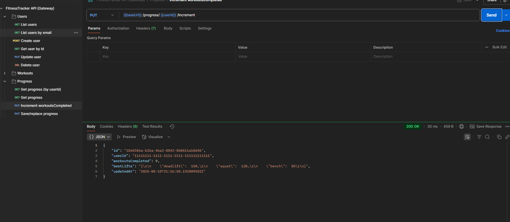

#### Put Save Progress


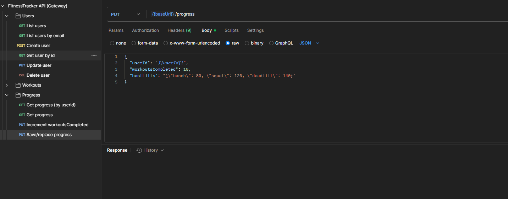
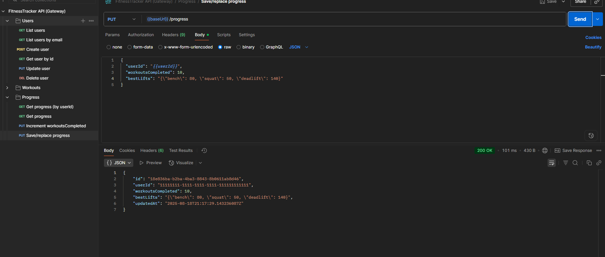


## Testing

* Alle Service-klassen zijn gedekt met unit tests (JUnit + Mockito).
* Screenshots van testresultaten kunnen hier toegevoegd worden.


## Authenticatie (Google OAuth2 + Postman testen)

Onze gateway gebruikt **Google OAuth2** voor authenticatie.  
Dit werkt op 2 manieren:

### 1. Browsergebruik (frontend)
- Ga naar `http://localhost:8080`  
- Je wordt automatisch doorgestuurd naar **Google login**  
- Na login bewaart de gateway je sessie en kan je de API via de frontend gebruiken

### 2. API-gebruik (Postman / andere clients)
Omdat de API een **JWT (Google ID token)** verwacht, moet je dit zelf meesturen:

1. Haal een Google **ID token** op:
   - Via de frontend: log in en kopieer het `id_token` uit de OAuth-respons.
   - Of via [OAuth 2.0 Playground](https://developers.google.com/oauthplayground/):
     - Vul je eigen **client-id** en **client-secret** in (zie `docker-compose.yml`).
     - Selecteer de scopes: `openid profile email`.
     - Autoriseer en wissel de code in voor tokens.
     - Kopieer het `ID token`.

2. Voeg dit toe aan je request in Postman:
   - **Header**:
     ```
     Authorization: Bearer <ID_TOKEN>
     ```
   - Optioneel: 
     ```
     Accept: application/json
     ```

3. Test:
   - Zonder token → je krijgt **401 Unauthorized** (correct gedrag).
   - Met geldig token → je krijgt de JSON-respons van de API, bv.  
     ```
     GET http://localhost:8080/api/users
     ```

### Unauthorized verzoek

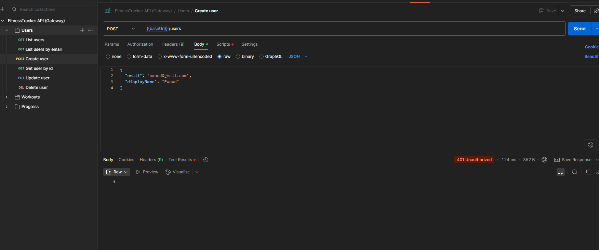

### Inloggen Google

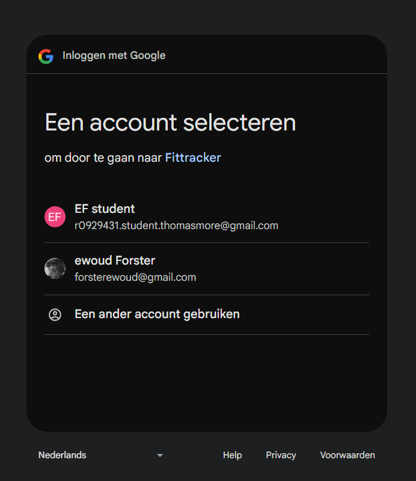

### Securitytoken Weergegeven in frontend

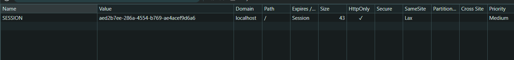

## CI/CD
* GitHub Actions builden automatisch alle microservices.
* Docker images worden gepubliceerd naar Docker Hub.
* `docker-compose.yml` trekt steeds de laatste images.

* GitHub Actions builden automatisch alle microservices.
* Docker images worden gepubliceerd naar Docker Hub.
* `docker-compose.yml` trekt steeds de laatste images.
